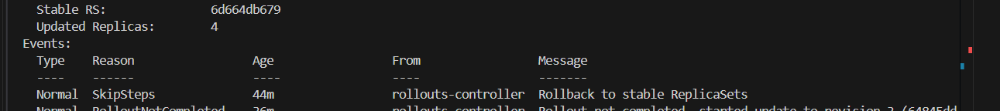
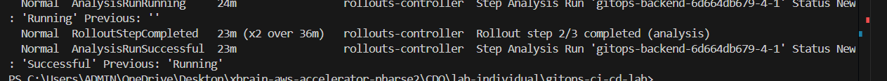

# Báo Cáo Challenge: Ship Smartly

> **Phân tích yêu cầu bài tập (Bạn có thể xoá phần này trước khi nộp):**
> 1. **Mọi thứ phải chuẩn GitOps:** Mọi cấu hình (từ app, canary, đến cảnh báo lỗi) đều phải được viết thành file YAML và đẩy lên GitHub.
> 2. **Rollback siêu tốc (< 5 phút):** Chứng minh khi gõ lệnh `git revert`, hệ thống tự động dọn dẹp và quay về phiên bản cũ.
> 3. **Cấu hình Cảnh Báo (SLO & Alert về Email):** Định nghĩa SLO và cấu hình Prometheus AlertManager gửi email khi lỗi.
> 4. **Canary Tự Động "Quay Xe" (Auto-abort):** Dùng `AnalysisTemplate` query Prometheus. Nếu lỗi vượt ngưỡng -> Tự động Abort.

---

## 1. Giải thích Câu lệnh (Query) đo lường và Ngưỡng (Threshold)

### Câu lệnh Query đo lường trên Prometheus
Để đánh giá chất lượng của phiên bản Canary, mình sử dụng câu lệnh PromQL sau trong `AnalysisTemplate`:

```promql
sum(rate(flask_http_request_total{status="500", namespace="default"}[2m])) 
/ 
sum(rate(flask_http_request_total{namespace="default"}[2m]))
```

**Giải thích:**
- Câu lệnh này tính **tỉ lệ phần trăm các request bị lỗi (mã 500)** trên tổng số tất cả các request trong vòng 2 phút qua.
- Nếu tỉ lệ này tăng lên, nghĩa là phiên bản mới đang gây ra sự cố.

### Ngưỡng giới hạn (Threshold) để huỷ Canary
- **Ngưỡng thiết lập:** `successCondition: result < 0.05`
- **Ý nghĩa:** Tỉ lệ request bị lỗi phải **nhỏ hơn 5%** (tức là 95% request phải thành công). 
- Nếu tỉ lệ lỗi vượt qua 5%, `AnalysisTemplate` sẽ trả về thất bại (Failed). Argo Rollouts sẽ dựa vào đó để tự động **Abort** (huỷ bỏ) bản cập nhật và tự động quay xe về phiên bản cũ an toàn.

---

## 2. Bằng chứng Hệ thống tự động huỷ (Auto-abort)

*Khi phiên bản mới (với ERROR_RATE cao) được đẩy lên, Argo Rollouts chia traffic cho bản Canary. Tuy nhiên AnalysisTemplate đã tự động phân tích và phát hiện tỉ lệ lỗi vượt ngưỡng 5%, hệ thống lập tức tự động Abort để bảo vệ người dùng.*




*(Ghi chú: Thay thế bằng ảnh chụp màn hình lệnh `kubectl argo rollouts get rollout...` hiển thị trạng thái Degraded/Aborted, hoặc chèn link video)*

---

## 3. Bằng chứng Nhận Email Cảnh báo (Alert)

*Hệ thống AlertManager đã quét và phát hiện SLO bị vi phạm do lỗi tăng vọt, và đã tự động bắn cảnh báo (Firing) về email cá nhân.*


*(Ghi chú: Thay thế bằng ảnh chụp màn hình hòm thư email của bạn)*

---

## 4. Bằng chứng Rollback qua Git

*Thực hiện lệnh `git revert` commit bị lỗi, đẩy lên GitHub. Hệ thống ArgoCD tự động nhận diện và đồng bộ lại trạng thái cũ hoàn toàn dưới 5 phút.*


*(Ghi chú: Thay thế bằng ảnh chụp Terminal khi gõ lệnh revert và ảnh ArgoCD xanh lá)*
