# 🚀 Hướng Dẫn Toàn Tập: Xây Dựng GitOps Knowledge Hub Pipeline

Tài liệu này ghi chép lại **toàn bộ quá trình thực tế** để xây dựng dự án "GitOps Knowledge Hub" từ con số 0, kết hợp GitHub Actions (CI) và Argo CD (CD) chạy trên Kubernetes.

---

## 🎯 1. Mục Đích Của Dự Án Này Là Gì?

Dự án này nhằm xây dựng một quy trình **Tự động hóa hoàn toàn (CI/CD)** theo chuẩn **GitOps**. Cụ thể:
1. **Nguồn sự thật duy nhất (Single Source of Truth):** Toàn bộ mã nguồn ứng dụng (HTML/CSS/JS) và cấu hình máy chủ (Kubernetes YAML) đều nằm trên GitHub.
2. **Không chạm tay vào Server:** Thay vì gõ lệnh `kubectl apply` thủ công, hệ thống tự động làm mọi thứ.
3. **Quy trình hoàn chỉnh:** 
   - Developer sửa code HTML -> `git push`.
   - **GitHub Actions (CI)**: Tự động đóng gói code thành Docker Image, đẩy lên Docker Hub, và cập nhật phiên bản mới vào file YAML.
   - **Argo CD (CD)**: Tự động phát hiện file YAML thay đổi, kéo phiên bản mới về và triển khai lên Kubernetes.

---

## 🔄 2. Sơ Đồ Luồng Hoạt Động Chi Tiết (Architecture Flow)

Dưới đây là bức tranh toàn cảnh về cách dữ liệu và code di chuyển tự động từ máy tính của bạn cho đến khi ứng dụng hiện lên màn hình web.

```mermaid
sequenceDiagram
    participant Dev as Bạn (Developer)
    participant Git as GitHub Repo
    participant CI as GitHub Actions (CI)
    participant Docker as Docker Hub
    participant CD as Argo CD (Kubernetes)
    
    Dev->>Git: 1. git push (Sửa file index.html)
    Git->>CI: 2. Trigger Workflow tự động
    
    rect rgb(30, 41, 59)
    Note over CI,Docker: Quá trình CI (Continuous Integration)
    CI->>CI: 3. Build Docker Image mới
    CI->>Docker: 4. Push Image (với Tag mới)
    CI->>Git: 5. Sửa file k8s/deployment.yaml & git push
    end
    
    rect rgb(22, 50, 43)
    Note over CD,Git: Quá trình CD (Continuous Delivery)
    loop Mỗi 3 phút
        CD->>Git: 6. "Đi tuần" kiểm tra thay đổi
    end
    Git-->>CD: 7. Phát hiện file YAML vừa bị sửa
    CD->>Docker: 8. Tải Image mới về cụm K8s
    CD->>CD: 9. Tạo Pod mới & Xóa Pod cũ
    end
    
    CD-->>Dev: 10. Web tự động cập nhật giao diện!
```



**Giải thích diễn biến dây chuyền (Như một nhà máy tự động):**
- **Chặng 1: Bạn (Developer) bắt đầu dây chuyền**
  Chỉ cần gõ `git push` để đẩy code lên GitHub.
- **Chặng 2: GitHub Actions (Quy trình CI - Đóng gói)**
  Robot GitHub Actions sẽ tự động gom code thành "thùng hàng" (Docker Image), dán nhãn phiên bản, chở lên kho Docker Hub. Sau đó, nó tự động mở sổ (file `deployment.yaml`) ra ghi lại phiên bản mới rồi đẩy lên lại GitHub.
- **Chặng 3: Argo CD (Quy trình CD - Giao hàng)**
  Argo CD cứ 3 phút lại đi tuần 1 lần. Khi phát hiện file YAML bị robot sửa, nó biết "có bản mới", liền tự động chạy ra kho Docker Hub kéo cái thùng hàng đó về.
- **Chặng 4: Kubernetes (Khởi động ứng dụng)**
  K8s nhẹ nhàng khởi động ứng dụng mới. Khi nào chạy ổn định, nó mới từ từ tắt cái cũ đi (Zero downtime). Không cần bạn phải can thiệp bất kỳ lệnh nào!

---

## 🛠️ 3. Các Bước Thực Hiện Chi Tiết

### Bước 1: Khởi tạo Project và Source Code
**Mục đích:** Tạo mã nguồn cho trang web và file cấu hình Docker.

**Câu lệnh & Thao tác:**
1. Tạo thư mục dự án và clone từ GitHub về.
2. Tạo file `app/index.html` chứa toàn bộ code giao diện của trang web (sử dụng CSS Glassmorphism và JS Routing).
3. Tạo file `app/Dockerfile`:
   ```dockerfile
   FROM nginx:alpine
   COPY index.html /usr/share/nginx/html/index.html
   EXPOSE 80
   ```
   *Giải thích lệnh:* Sử dụng máy chủ Nginx cực nhẹ, copy file `index.html` vào thư mục gốc của Nginx để phục vụ web ở cổng 80.

### Bước 2: Khai báo Kubernetes Manifests
**Mục đích:** Khai báo cấu hình "trạng thái mong muốn" (Desired State) cho Kubernetes.

**Câu lệnh & Thao tác:**
1. Tạo file `k8s/deployment.yaml`: Khai báo cần chạy 2 Pod (bản sao) của ứng dụng.
2. Tạo file `k8s/service.yaml`: Khai báo mở cổng (NodePort) để truy cập web từ bên ngoài.

### Bước 3: Thiết lập GitHub Actions (CI Pipeline)
**Mục đích:** Con robot tự động Build Docker Image mỗi khi push code.

**Câu lệnh & Thao tác:**
1. Lên trang GitHub > **Settings** > **Secrets** tạo 2 biến: `DOCKER_USERNAME` và `DOCKER_PASSWORD`.
2. Tạo file `.github/workflows/ci.yml`. Trong file này định nghĩa:
   - *Checkout code*: Kéo code về máy chủ GitHub.
   - *Login Docker*: Đăng nhập bằng Secret.
   - *Build & Push*: Tạo Image và đẩy lên Docker Hub.
   - *Update Manifest*: Dùng lệnh `sed` để sửa đổi tag phiên bản trong file `k8s/deployment.yaml` rồi tự động `git push` đoạn sửa đó lên lại GitHub.

### Bước 4: Cài đặt Argo CD lên Kubernetes
**Mục đích:** Cài đặt "Người quản lý" Argo CD vào trong Kubernetes để nó đi kéo code về.

**Câu lệnh:**
```bash
# Bắt buộc gõ 'wsl' trước nếu bạn dùng Windows để vào môi trường Linux
wsl

# Tạo không gian riêng cho Argo CD
kubectl create namespace argocd

# Cài đặt toàn bộ hệ thống Argo CD
kubectl apply -n argocd -f https://raw.githubusercontent.com/argoproj/argo-cd/stable/manifests/install.yaml
```

### Bước 5: Truy cập giao diện Argo CD
**Mục đích:** Mở cổng để truy cập trang quản lý của Argo CD trên trình duyệt.

**Câu lệnh:**
```bash
# Mở cổng 8080. Lệnh này sẽ chạy vĩnh viễn, không được tắt Terminal này.
kubectl port-forward svc/argocd-server -n argocd 8080:443
```
*Giải thích:* Nối cổng 443 của Argo CD trong K8s ra cổng 8080 trên Windows của bạn.

Lấy mật khẩu đăng nhập:
```bash
# Mở Terminal thứ 2 (cũng gõ 'wsl' trước), chạy lệnh:
kubectl -n argocd get secret argocd-initial-admin-secret -o jsonpath="{.data.password}" | base64 --decode
```

### Bước 6: Tạo App trên Argo CD
**Mục đích:** Ra lệnh cho Argo CD theo dõi thư mục `k8s` trên GitHub của bạn.

**Thao tác:**
Vào `https://localhost:8080` (bấm Advanced > Proceed), login bằng `admin` và mật khẩu vừa lấy. Bấm **+ NEW APP**:
- **Application Name:** `gitops-web-app`
- **Project:** `default`
- **Sync Policy:** `Automatic` (Nhớ tick chọn **Prune** và **Self Heal** để nó tự dọn dẹp và phục hồi).
- **Repository URL:** `https://github.com/nguyenmen04/gitops-ci-cd-lab.git`
- **Revision:** `main`
- **Path:** `k8s`
- **Cluster URL:** `https://kubernetes.default.svc`
- **Namespace:** `default`

### Bước 7: Mở cổng xem Trang Web
**Mục đích:** Sau khi Argo CD báo "Healthy", web đã chạy nhưng nằm kín trong K8s, cần mở cổng để xem.

**Câu lệnh:**
```bash
# Mở Terminal thứ 3 (nhớ gõ wsl). Giữ nguyên không tắt.
kubectl port-forward svc/gitops-web 8888:80 --address 0.0.0.0
```
*Truy cập:* `http://localhost:8888` để xem thành quả.

### Bước 8: Kiểm thử vòng lặp GitOps
**Mục đích:** Test thử sửa code xem web có tự đổi không.

**Câu lệnh:**
```bash
git add .
git commit -m "Sửa đổi nội dung web"
# Nếu bị lỗi rejected, chạy git pull --rebase trước
git push
```
*Kết quả:* Chờ 2-3 phút, F5 trình duyệt là web tự cập nhật.

---

## ⚠️ 4. Những Lỗi Kinh Điển Thường Mắc Phải (Cần Rất Lưu Ý)

### 🚨 Lỗi 1: Gõ lệnh `kubectl` báo "not recognized" trên Windows
- **Triệu chứng:** `The term 'kubectl' is not recognized as the name of a cmdlet...`
- **Nguyên nhân:** Bạn đang đứng ở PowerShell của Windows thay vì Ubuntu (Linux).
- **Cách khắc phục:** Luôn luôn gõ lệnh `wsl` và ấn Enter trước khi chạy bất kỳ lệnh `kubectl` nào ở một cửa sổ Terminal mới.

### 🚨 Lỗi 2: Lỗi "app path does not exist" trên Argo CD
- **Triệu chứng:** Nhập đúng chữ `k8s` nhưng Argo CD vẫn báo lỗi đỏ chót không tìm thấy đường dẫn.
- **Nguyên nhân:** Có thể do dính khoảng trắng tàng hình (Space) ở cuối chữ `k8s ` hoặc ở cuối đường link URL Repo. Hoặc do bạn điền mục Revision là `HEAD` nhưng nhánh Git của bạn lại tên là `main`.
- **Cách khắc phục:** 
  1. Xóa sạch ô Path và gõ lại đúng 3 phím `k8s`, tuyệt đối không gõ dấu cách.
  2. Ở mục Revision, đổi chữ `HEAD` thành `main`.
  3. Làm xong mà vẫn lỗi thì F5 lại trang web Argo CD và điền lại từ đầu (do web bị kẹt cache).

### 🚨 Lỗi 3: Không truy cập được `http://localhost:8888` (ERR_CONNECTION_REFUSED)
- **Triệu chứng:** Web quay vòng vòng rồi báo không kết nối được.
- **Nguyên nhân:** Bạn chưa chạy lệnh `port-forward` cho ứng dụng, HOẶC bạn đã chạy nhưng lỡ bấm `Ctrl+C` hoặc tắt cái cửa sổ Terminal đang chạy lệnh đó đi. Nhớ rằng lệnh này giống như cái vòi nước, bạn tắt Terminal là vòi nước khóa lại.
- **Cách khắc phục:** Mở Terminal WSL mới, chạy lại lệnh `kubectl port-forward svc/gitops-web 8888:80 --address 0.0.0.0` và để nó đứng im ở đó.

### 🚨 Lỗi 4: Lỗi `! [rejected] main -> main (fetch first)` khi `git push`
- **Triệu chứng:** Git báo lỗi không cho push, bắt phải pull trước.
- **Nguyên nhân:** Đây là "đặc sản" của GitOps! Trong quá trình bạn sửa code ở máy, con robot GitHub Actions đã chạy xong và tự động push một cục code (sửa file deployment.yaml) lên GitHub rồi. Code trên mạng đang "mới" hơn code dưới máy bạn. Git sợ bạn ghi đè mất công sức của robot nên chặn lại.
- **Cách khắc phục:** Phải tải code của robot về gộp chung một cách khéo léo trước khi đẩy lên.
  ```bash
  # Tạm cất code của bạn, tải code robot về làm nền, rồi đắp code của bạn lên trên
  git pull --rebase
  
  # Sau khi gộp xong mượt mà, đẩy lên lại
  git push
  ```

### 🚨 Lỗi 5: Nóng lòng bấm REFRESH thay vì chờ Argo CD tự làm
- **Triệu chứng:** Push code xong web không đổi ngay lập tức, phải bấm Refresh trên Argo CD mới đổi.
- **Nguyên nhân:** Theo mặc định, Argo CD 3 phút mới đi kiểm tra GitHub một lần. Đồng thời GitHub Actions cũng tốn 1-2 phút để build Docker Image.
- **Cách khắc phục:** Nếu muốn tự động hoàn toàn, bạn cứ việc push code rồi đi pha ly cafe (5 phút), quay lại tự động web đã được cập nhật. Đừng nóng vội bấm Refresh nếu bạn muốn test "sức mạnh tự động" của hệ thống.
